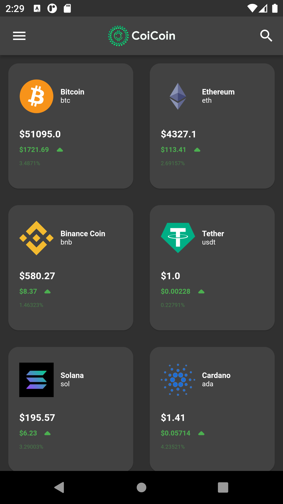
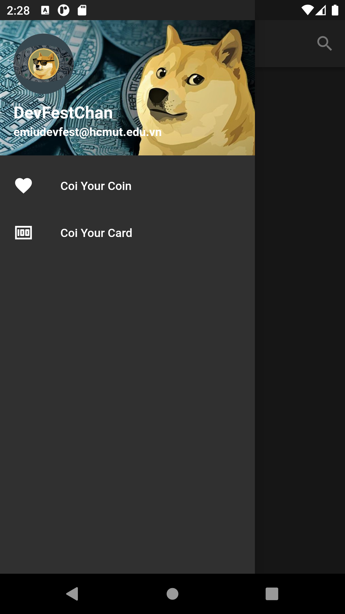
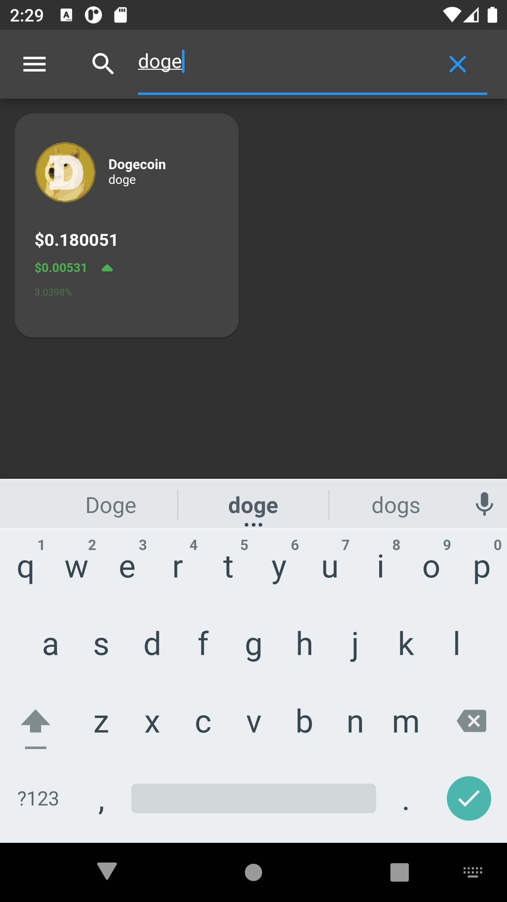
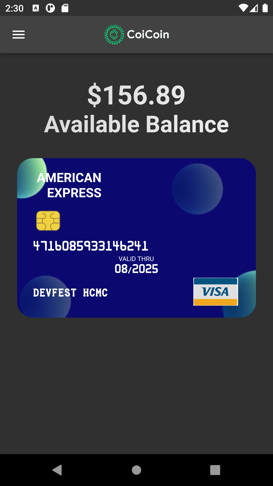

# CoiCoin Cryto Tracker - Demo Product

This is a basic cryptocurrency price-tracking application to the [Demo Product on Google DevFest HCMC 2021](https://devfesthcm.com/). Google DevFest HCMC 2021 is a special training course on Flutter which helps you to improve your knowledge of building the front-end of a realistic application.

## Table of contents

- [Overview](#overview)
  - [The course](#the-course)
  - [Photos](#photos)
- [Process](#process)
  - [Built with](#built-with)
  - [What I learned](#what-i-learned)
- [Contributors](#contributors)

## Overview

### The course

Through the training course, DevFest-ers should be able to:

- Get used to the Dart Programming Language.
- Know Layout, Navigation, and Theming in Flutter.
- Manage State in Flutter
- Build a Flutter App and do Testings.

### Screenshot

- Logo


- App

<p align="center">
  
  
  
  
</p>

## Process

### Built with

- Dart
- Colors, Icons, Credit Card Slider from Flutter Material and Package
- Cryto APIs from CoinMarketCap

### What We learned

After finishing the project, I am finally able to learn how to use SASS to improve my performance in styling as well as responsive design for mobile and desktop screen size.

- Variables in SCSS
```scss
$desaturated-red: hsl(0, 36%, 70%);
$dark-grayish-red: hsl(0, 6%, 24%);
$lightgray: hsl(356,18%,82%);
$gradient1: hsl(0, 0%, 100%);
$gradient2: hsl(0, 100%, 98%);
$light-gradient2: hsl(0, 73%, 90%);
$gradient3: hsl(0, 80%, 86%);
$gradient4: hsl(0, 74%, 74%);
$error: hsl(0,65%,65%);
$angle: 135deg;
```
- Add Event listener in Javascript
```js
form.addEventListener("submit", (e) => {
    e.preventDefault();
    if(!re.test(document.forms["submit"]["email"].value)) {
        msg.style.display = "block";
        icon.style.display = "flex";
    } else {
        msg.style.display = "none";
        icon.style.display = "none";
    }
})
```

### Continued development

## Contributors

- Đỗ Trường Thịnh
   - Github - [lonelyknight2902](https://github.com/lonelyknight2902)
   - Linkedin - [Trường Thịnh Đỗ](www.linkedin.com/in/trường-thịnh-đỗ-418616209)
- Nguyên
   - Github - [lonelyknight2902](https://github.com/lonelyknight2902)
   - Linkedin - [Trường Thịnh Đỗ](www.linkedin.com/in/trường-thịnh-đỗ-418616209)
- Phạm Đức Hải
   - Github - [lonelyknight2902](https://github.com/lonelyknight2902)
   - Linkedin - [Trường Thịnh Đỗ](www.linkedin.com/in/trường-thịnh-đỗ-418616209)
- Phạm Anh Quân
   - Github - [ethanpham](https://github.com/ethanpham)
   - Linkedin - [Quân Phạm Anh](https://www.linkedin.com/in/qu%C3%A2n-ph%E1%BA%A1m-anh-a54464217/)
  
