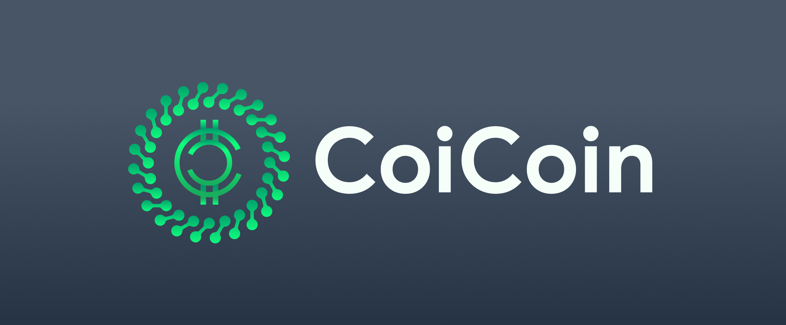

# CoiCoin Cryto Tracker - Demo Product

This is a basic cryptocurrency price-tracking application to the [Demo Product on Google DevFest HCMC 2021](https://devfesthcm.com/). Google DevFest HCMC 2021 is a special training course on Flutter which helps you to improve your knowledge of building the front-end of a realistic application.

## Table of contents

- [Overview](#overview)
  - [The course](#the-course)
  - [Photos](#photos)
- [Process](#process)
  - [Built with](#built-with)
  - [What we learned](#what-we-learned)
  - [How to run](#how-to-run)
- [Contributors](#contributors)

## Overview

### The course

Through the training course, DevFest-ers should be able to:

- Get used to the Dart Programming Language.
- Know Layout, Navigation, and Theming in Flutter.
- Manage State in Flutter
- Build a Flutter App and do Testings.

### Screenshot

- Logo



- App

<p align="center">
  
  
</p>
<p align="center">
  
  
</p>

## Process

### Built with

- Dart
- Colors, Icons, Credit Card Slider from Flutter Material and Package
- Cryto APIs from CoinMarketCap

### What we learned

After finishing the project, we can build a Menu Bar on the side, a Credit Card and a realtime automatically updated data using Cryto APIs.

- Menu Bar
```dart
@override
  Widget build(BuildContext context) {
    return Drawer(
        child: ListView(
          children: [
            UserAccountsDrawerHeader(
              accountName: const Text('DevFestChan'),
              accountEmail: const Text('emiudevfest@hcmut.edu.vn'),
              currentAccountPicture: CircleAvatar(
                  child: ClipOval(
                    child: Image.asset('./assets/doge.jpg'),
                  )),
            ),
            ListTile(
                leading: const Icon(Icons.favorite),
                title: const Text('Coi Your Coin'),
            ListTile(
                leading: const Icon(Icons.money),
                title: const Text('Coi Your Card'),
          ],
    ));
  }
```
- Credit Card.
```dart
  @override
  Widget build(BuildContext context) {
    return Scaffold(
        appBar: AppBar(
          centerTitle: true,
          title: Image.asset('assets/coicoin_logo.png', height: 30),
        ),
        body: Container(
          alignment: Alignment.center,
          padding: const EdgeInsets.fromLTRB(5.0, 40.0, 5.0, 0.0),
          child: Column(
            children: <Widget>[
              Text(
                '\$156.89',
                style: TextStyle(foreground: Paint()..shader = linearGradient)),
              Text(
                'Available Balance',
                style: TextStyle(foreground: Paint()..shader = linearGradient),
              ),
              const SizedBox(height: 50),
              Transform.scale(
                scale: 1.2,
                child: CreditCard(
                  cardBackground:
                      ImageCardBackground(const AssetImage('assets/card_bg.png')),
                  cardNetworkType: CardNetworkType.visa,
                  cardHolderName: 'DevFest HCMC',
                  cardNumber: '4716085933146241',
                  company: CardCompany.americanExpress,
                  validity: Validity(validThruMonth: 8, validThruYear: 2025),
                ),
              ),
            ],
          ),
        ));
  }
```
- Cryto APIs.
```dart
  Future<List<Coin>> fetchCoin() async {
    coinList = [];
    filter = [];
    final response = await http.get(Uri.parse(
        'https://api.coingecko.com/api/v3/coins/markets?vs_currency=usd&order=market_cap_desc&per_page=100&page=1&sparkline=false'));

    if (response.statusCode == 200) {
      List<dynamic> values = [];
      values = json.decode(response.body);
      if (values.isNotEmpty) {
        for (int i = 0; i < values.length; i++) {
          if (values[i] != null) {
            Map<String, dynamic> map = values[i];
            coinList.add(Coin.fromJson(map));
            filter.add(Coin.fromJson(map));
          }
        }
      }
      setState(() {
        coinList;
        filter;
      });
      return coinList;
    }
    else {
      throw Exception("Failed to load");
    }
  }
```

### How to run
```cmd
  $ dart --no-sound-null-safety run
  $ flutter run --no-sound-null-safety
```


## Contributors

- Đỗ Trường Thịnh
   - Github - [lonelyknight2902](https://github.com/lonelyknight2902)
   - Linkedin - [Trường Thịnh Đỗ](www.linkedin.com/in/trường-thịnh-đỗ-418616209)
- Hứa Hoàng Nguyên
   - Github - [SleepyCatOnTheBed](https://github.com/SleepyCatOnTheBed)
   - Linkedin - [Hoàng Nguyên Hứa](www.linkedin.com/in/trường-thịnh-đỗ-418616209)
- Phạm Đức Hải
   - Github - [ihaveatalkingtree](https://github.com/ihaveatalkingtree)
   - Linkedin - [Hải Phạm Đức](www.linkedin.com/in/trường-thịnh-đỗ-418616209)
- Phạm Anh Quân
   - Github - [ethanpham](https://github.com/ethanpham)
   - Linkedin - [Quân Phạm Anh](https://www.linkedin.com/in/qu%C3%A2n-ph%E1%BA%A1m-anh-a54464217/)
  
